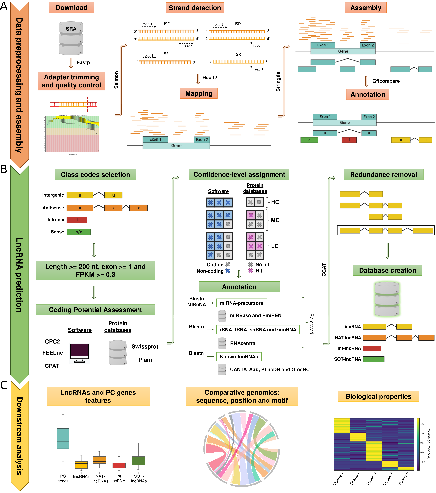

# Cucurbit lncRNAs landscape

## Introduction

 <div align="justify"> Long non-coding RNAs (lncRNAs) constitute a fascinating class of regulatory RNAs, widely distributed in eukaryotes. In plants, they exhibit features such as tissue-specific expression, spatiotemporal regulation and responsiveness to environmental changes, suggesting their involvement in specific biological processes. Although an increasing number of studies support the regulatory role of lncRNAs in model plants, our knowledge about these transcripts in relevant crops is limited. </div>

<br />

<div align="justify"> In the paper <b>"Identification, characterization and transcriptional analysis of long non-coding RNAs in Cucurbits"</b>, we identified and analyze potential lncRNAs in nine representative species of the family <em>Cucurbitaceae</em> comprising a dataset of more than 1,000 RNA-seq studies. </div>

<br />
<br />

<div align="center"> <sub><b>Table 1: Information on the number of RNA-seq samples and projects used to predict and analyze lncRNAs in the nine selected cucurbit species.</b></sub> </div>

<br />

| <sub>Species</sub>                                  | <sub>Download<br />(Samples)</sub> | <sub>QC<br />(Samples)</sub> | <sub>Strand<br />Specific<br />(Samples)</sub> | <sub>Download<br />(Projects)</sub> | <sub>QC<br />(Projects)</sub> | <sub>Strand<br />Specific<br />(Projects)</sub> | <sub>Final Data Size <br />(bytes; Gb)</sub> |
|-----------------------------------------------------|-------------------------------|-------------------------|------------------------------------------------|--------------------------------|--------------------------|-------------------------------------------------|---------------------------------------------|
| <sub>*Cucumis sativus* (csa)</sub>                  | <sub>1388</sub>               | <sub>1334</sub>         | <sub>360</sub>                                 | <sub>129</sub>                 | <sub>127</sub>           | <sub>35</sub>                                   | <sub>1167.43</sub>                          |
| <sub>*Cucumis melo* (cme)</sub>                     | <sub>802</sub>                | <sub>776</sub>          | <sub>383</sub>                                 | <sub>45</sub>                  | <sub>44</sub>            | <sub>16</sub>                                   | <sub>820.87</sub>                           |
| <sub>*Citrullus lanatus* (cla)</sub>                | <sub>717</sub>                | <sub>711</sub>          | <sub>231</sub>                                 | <sub>55</sub>                  | <sub>54</sub>            | <sub>17</sub>                                   | <sub>663.61</sub>                           |
| <sub>*Lagenaria siceraria* (lsi)</sub>              | <sub>92</sub>                 | <sub>92</sub>           | <sub>9</sub>                                   | <sub>7</sub>                   | <sub>7</sub>             | <sub>3</sub>                                    | <sub>27.07</sub>                            |
| <sub>*Cucurbita moschata* (cmo)</sub>               | <sub>127</sub>                | <sub>126</sub>          | <sub>39</sub>                                  | <sub>17</sub>                  | <sub>16</sub>            | <sub>6</sub>                                    | <sub>102.73</sub>                           |
| <sub>*Cucurbita argyrosperma* (car)</sub>           | <sub>10</sub>                 | <sub>10</sub>           | <sub>9</sub>                                   | <sub>2</sub>                   | <sub>2</sub>             | <sub>2</sub>                                    | <sub>30.36</sub>                            |
| <sub>*Cucurbita pepo* (cpe)</sub>                   | <sub>143</sub>                | <sub>142</sub>          | <sub>50</sub>                                  | <sub>13</sub>                  | <sub>13</sub>            | <sub>7</sub>                                    | <sub>112.61</sub>                           |
| <sub>*Cucurbita maxima* (cma)</sub>                 | <sub>50</sub>                 | <sub>50</sub>           | <sub>27</sub>                                  | <sub>10</sub>                  | <sub>10</sub>            | <sub>4</sub>                                    | <sub>43.36</sub>                            |
| <sub>*Momordica charantia* (mch)</sub>              | <sub>74</sub>                 | <sub>74</sub>           | <sub>8</sub>                                   | <sub>5</sub>                   | <sub>5</sub>             | <sub>2</sub>                                    | <sub>27.73</sub>                            |

<br />

<div align="justify">All the lncRNAs identified across the nine cucurbit species can be found in <a href="Results/LncRNAs_prediction">Results/LncRNAs_prediction</a> in several formats (fasta, tsv and gtf) so that they can be used by the scientific community. </div>

<br />


## Pipeline

To identify and analyze potential lncRNAs, we used a custom pipeline consisting of three parts:

- <div align="justify"> <b>Data preprocessing and assembly</b><br /><br />All RNA-seq samples from Sequence Read Archive (SRA) database and from a particular species are collected (SRA Toolkit). Next, we remove adapters and filter the reads by quality (Fastp). Then, we deduce whether the library is strand-specific or not, and select the strand-specific samples (Salmon).<br /><br />Once the data have been preprocessed, we map the clean data to the reference genome (Hisat2) and assemble the transcriptome using a genome-guided assembly approach (Stringtie2). Finally, we classify the assembled transcripts by their genomic position relative to the protein-coding genes (Gffcompare). As a result, a class code is assigned to each transcript.</div><br />

- <div align="justify"> <b>LncRNA prediction</b><br /><br />We select transcripts that have any of the following five class codes: “u” (intergenic), “x” (antisense), “i” (intronic) and, “o” (sense) or “e” (sense). Next, transcripts are filtered by length (longer than 200 nucleotides) and expression level (more than 0.3 FPKM).<br /><br />Then, we assess the coding potential of each transcript using three alignment-free computational tools (CPC2, FEELnc and CPAT) and two protein databases (Swissprot and Pfam). In the following step, we classify the transcripts into three confidence-levels (High-, medium- and low-confidence) according to the results of the previous step. Those transcripts that don’t meet any of the present scenarios are not classified. After that, we annotate transcripts using different ncRNAs databases and those annotated as miRNA precursors or housekeeping ncRNAs are discarded. The program used to align the transcripts to the different ncRNAs databases is blastn. In the case of miRNA precursors, the MIReNA program is also used to validate them. We also annotate transcripts using databases of known potential lncRNAs in order to provide additional information.</b><br /><br />Finally, we discard redundant transcripts (CGAT) and create the database that will contain all potential lncRNAs. In addition, the different classes of potential lncRNAs will be renamed from intergenic, antisense, intronic and sense to lincRNA, NAT-lncRNA, int-lncRNA and SOT-lncRNA, respectively.</div><br />

- <div align="justify"> <b>Downstream analysis</b> </div><br />Now, there are some downstream analyses that we can perform:<br /><br />
 
    + Molecular properties comparison (LncRNAs vs Protein-coding genes).
    + Comparative genomics (Sequence, position and motif level).
    + Tissue-specificity analysis.
    + Differential expression (development and environment).

<br />
<br />

<div align="justify"> <sub><b>Figure 1: Graphic representation of the bioinformatic workflow used for the prediction, classification and analysis of lncRNAs. (A) Data recovering, preprocessing and transcriptome assembly. (B) Prediction and categorization of lncRNAs: intergenic (lincRNAs), natural antisense (NAT-lncRNAs), intronic (int-lncRNAs) and sense overlapping (SOT-lncRNAs) lncRNAs. (C) Downstream analysis to compare lncRNA features, conservation at three levels (sequence, genomic position and motifs) and differential expression (related to tissue, development and environment).</b></sub> </div>

<br />



<br />

<div align="justify"> This pipeline has been configured to be executed in a HPC cluster environment using the open-source workload manager Slurm and all the scripts that compose it are stored in <a href="Scripts">Scripts</a>. </div>

<br />

<div align="justify">Initially, this pipeline was designed for cucurbit species, but it could be adapted to other species. </div>

<br />

<div align="justify"> For more information you can read the paper <b>"Identification, characterization and transcriptional analysis of long non-coding RNAs in Cucurbits"</b>. </div>

<br />

## Softwares

- [SRA Toolkit](https://github.com/ncbi/sra-tools) v.2.11.2
- [FastQC](https://github.com/s-andrews/FastQC) v.0.11.9
- [Multiqc](https://github.com/MultiQC/MultiQC) v.1.11
- [Fastp](https://github.com/OpenGene/fastp) v.0.23.2
- [RSEM](https://github.com/deweylab/RSEM) v.1.3.3
- [Salmon](https://github.com/COMBINE-lab/salmon) v.1.6.0
- [HISAT2](https://github.com/DaehwanKimLab/hisat2) v2.2.1
- [StringTie2](https://github.com/gpertea/stringtie) v2.2.0
- [GffCompare](https://github.com/gpertea/gffcompare) v.0.12.6
- [CPC2](https://github.com/gao-lab/CPC2_standalone) v.1.0.1
- [FEELnc](https://github.com/tderrien/FEELnc) v.0.2
- [CPAT](https://cpat.readthedocs.io/en/latest/) v.3.0.2
- [DIAMOND](https://github.com/bbuchfink/diamond) v.2.0.14
- [Transdecoder](https://github.com/TransDecoder/TransDecoder) v.5.5.0
- [HMMER](https://github.com/EddyRivasLab/hmmer) v.2.0.14
- [NCBI-BLAST](https://ftp.ncbi.nlm.nih.gov/blast/executables/blast+/) v.2.13.0+
- [MIReNA](https://www.lcqb.upmc.fr/mirena/index.html) v.2.0
- [CGAT](https://cgat.readthedocs.io/en/latest/cgat.html) v.1.0

<br />

## Databases

- Swissprot
- Pfam
- RNAcentral
- miRBase
- PmiREN
- CANTATAdb
- PLncDB
- GreeNC

<br />

## Getting Started

These instructions will get you a copy of the project up and running on your local machine for development and testing purposes. See deployment for notes on how to deploy the project on a live system.

End with an example of getting some data out of the system or using it for a little demo

## Running the tests

Explain how to run the automated tests for this system

```
Give an example
```

## Contributing

Please read [CONTRIBUTING.md](https://gist.github.com/PurpleBooth/b24679402957c63ec426) for details on our code of conduct, and the process for submitting pull requests to us.

## Authors

* **Pascual Villalba-Bermell** - *Initial work* - [pasviber](https://github.com/pasviber)

See also the list of [contributors](https://github.com/your/project/contributors) who participated in this project.

## License

This project is licensed under the MIT License - see the [LICENSE.md](LICENSE.md) file for details

## Acknowledgments

* HPC i2sysBio
